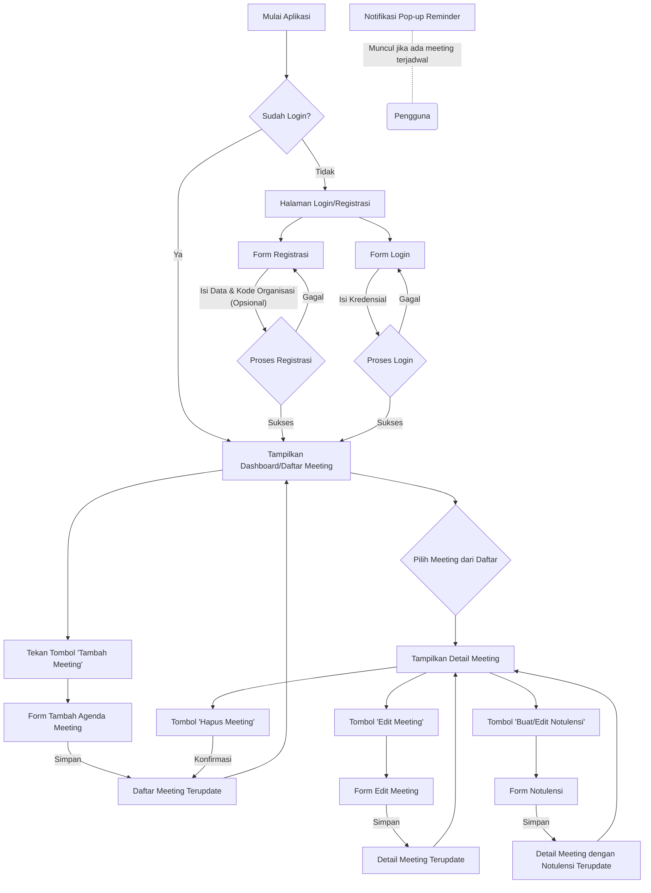

# Dokumen Software Requirement Specification (SRS)

## MVP Aplikasi Pengingat & Notulensi Meeting

- **Versi:** 0.1
- **Tanggal:** 24 Mei 2025
- **Penyusun:** Azhar Maulana F (221240001263)

# Daftar Isi

## 1. Pendahuluan

- ### 1.1 Tujuan Dokumen
- ### 1.2 Ruang Lingkup Produk (MVP)
- ### 1.3 Definisi, Akronim, dan Singkatan

## 2. Deskripsi Umum

- ### 2.1 Perspektif Produk
- ### 2.2 Fungsi Utama Produk (MVP)
- ### 2.3 Karakteristik Pengguna
- ### 2.4 Batasan Umum
- ### 2.5 Asumsi dan Ketergantungan

## 3. Kebutuhan Spesifik

- ### 3.1 Alur Pengguna (User Flow)
- ### 3.2 Kebutuhan Fungsional
- ### 3.3 Kebutuhan Non-Fungsional
- ### 3.4 Kebutuhan Antarmuka Eksternal

## 4. Rancangan Skema Database

- > Appwrite Collections – Single Project, Tenant ID-based

## 5. Arsitektur Multi-Tenancy

- > Appwrite – Single Project, Tenant ID-based

---

# 1. Pendahuluan

### 1.1. Tujuan Dokumen

Dokumen ini bertujuan untuk mendefinisikan secara jelas kebutuhan fungsional dan non-fungsional untuk Minimum Viable Product (MVP) dari aplikasi SaaS pengingat meeting dan pencatat notulensi. Dokumen ini akan menjadi acuan utama bagi tim pengembangan dalam membangun produk tahap awal.

### 1.2. Ruang Lingkup Produk (MVP)

MVP akan fokus pada fungsionalitas inti berikut:

- Registrasi dan login pengguna, dengan asosiasi ke Organisasi/Tenant.
- Pembuatan, pengeditan, penghapusan, dan penampilan daftar agenda meeting, terbatas pada data tenant pengguna.
- Pengaturan reminder meeting dasar (H-1 dan Hari-H) melalui notifikasi pop-up in-app.
- Pencatatan notulensi meeting sederhana (teks bebas), terbatas pada data tenant pengguna.
- Aplikasi mobile dibangun menggunakan Flutter.
- Backend dan database menggunakan **satu Proyek Appwrite tunggal**, dengan isolasi data multi-tenant dicapai melalui atribut `tenantId` pada setiap dokumen dan konfigurasi permissions yang ketat.

### 1.3. Definisi, Akronim, dan Singkatan

- **SaaS:** Software as a Service
- **MVP:** Minimum Viable Product
- **SKPL:** Spesifikasi Kebutuhan Perangkat Lunak (SRS - Software Requirements Specification)
- **UI:** User Interface
- **UX:** User Experience
- **Tenant / Organisasi:** Sebuah entitas (misalnya perusahaan) yang menggunakan layanan aplikasi ini, datanya diisolasi secara logis dari tenant lain dalam satu Proyek Appwrite.
- **`tenantId`:** ID unik yang mengidentifikasi sebuah Tenant/Organisasi. Digunakan sebagai kunci untuk isolasi data.
- **Appwrite Project:** Sebuah instansi layanan Appwrite tunggal yang melayani semua Tenant/Organisasi.

# 2. Deskripsi Umum

### 2.1. Perspektif Produk

Aplikasi ini adalah produk SaaS baru yang dirancang untuk membantu profesional dan tim dari berbagai bidang usaha dalam mengelola agenda meeting dan mencatat hasil meeting secara efisien. Versi MVP akan berupa aplikasi mobile (Flutter) yang terhubung ke satu Proyek Appwrite tunggal, dengan data antar tenant diisolasi menggunakan atribut `tenantId` dan permissions.

### 2.2. Fungsi Utama Produk (MVP)

1.  **Manajemen Pengguna & Tenant:** Pengguna dapat mendaftar dan login, diasosiasikan dengan `tenantId` tertentu.
2.  **Manajemen Agenda Meeting:** Pengguna dapat membuat, melihat, mengedit, dan menghapus agenda meeting yang hanya dimiliki oleh tenantnya.
3.  **Pengingat Meeting:** Sistem memberikan pengingat pop-up in-app untuk meeting yang akan datang milik pengguna.
4.  **Pencatatan Notulensi:** Pengguna dapat membuat dan menyimpan catatan notulensi dasar untuk meeting milik tenantnya.

### 2.3. Karakteristik Pengguna

- Profesional dari berbagai bidang usaha.
- Individu atau tim kecil dalam sebuah organisasi yang sering mengadakan meeting.
- Pengguna yang membutuhkan alat sederhana untuk mengatur jadwal dan mencatat hasil meeting, dengan data terisolasi per organisasi.
- Memiliki akses ke perangkat mobile (Android/iOS).

### 2.4. Batasan Umum

1.  Pengembangan MVP harus diselesaikan dalam kurun waktu 1 bulan.
2.  Teknologi yang digunakan adalah Flutter untuk frontend mobile dan satu Proyek Appwrite untuk backend & database.
3.  Implementasi multi-tenancy adalah dengan menggunakan atribut `tenantId` di setiap dokumen relevan dan konfigurasi Document Level Permissions yang sangat ketat di Appwrite.
4.  Fokus pada fungsionalitas inti, antarmuka pengguna sederhana dan fungsional.

### 2.5. Asumsi dan Ketergantungan

1.  Layanan Appwrite (Cloud atau Self-hosted) tersedia dan berfungsi dengan baik.
2.  Pengguna memiliki koneksi internet yang stabil untuk menggunakan aplikasi.
3.  Perangkat mobile pengguna kompatibel dengan aplikasi Flutter yang dibangun.
4.  Untuk MVP, proses pembuatan entri Organisasi/Tenant baru (dan `tenantId` nya) dapat dilakukan secara semi-manual atau melalui script backend sederhana oleh administrator sistem. Pengguna pertama dari organisasi baru mungkin bisa memicu pembuatan ini.
5.  **Keamanan isolasi data sangat bergantung pada implementasi Document Level Permissions yang benar di Appwrite.**

# 3. Kebutuhan Spesifik

Berikut adalah **format revisi** agar lebih konsisten, rapi, dan mudah dibaca — termasuk perbaikan heading, penomoran, indentasi, pemisahan bagian, dan penekanan poin-poin penting:

---

## 3.1. Alur Pengguna (User Flow)

Berikut adalah diagram alur pengguna dasar untuk fungsi-fungsi utama:



---

## 3.2. Kebutuhan Fungsional

### UF000 – Manajemen Organisasi/Tenant (Dasar)

- **Deskripsi:** Sistem harus dapat mendefinisikan organisasi (tenant) dengan `tenantId` unik.
- **Skema MVP:** Tenant baru dapat dibuat secara semi-otomatis saat user mendaftar menggunakan kode organisasi baru.
- **Output:** Pengguna diasosiasikan dengan satu `tenantId`.

### UF001 – Registrasi Pengguna

- **Input:** Email, password, kode organisasi (opsional/wajib).
- **Proses:** Validasi email, cek keunikan, asosiasi tenant. Buat organisasi baru jika diperlukan.
- **Output:** Akun dibuat dan diasosiasikan dengan `tenantId`.

### UF002 – Login Pengguna

- **Input:** Email, password.
- **Proses:** Verifikasi kredensial, ambil `tenantId`.
- **Output:** Login berhasil, data sesi dimuat.

### UF003 – Pembuatan Agenda Meeting Baru

- **Input:** Data agenda (judul, waktu, lokasi/link, dsb.).
- **Proses:** Validasi, simpan dengan `tenantId`, atur permissions.
- **Output:** Meeting muncul di daftar tenant.

### UF004 – Melihat Daftar Meeting

- **Proses:** Query dengan `Query.equal('tenantId', tenantId_user)`.
- **Output:** Daftar agenda meeting.

### UF005 – Melihat Detail Meeting

- **Proses:** Query dengan validasi `tenantId`.
- **Output:** Tampilkan informasi lengkap.

### UF006 – Mengedit Agenda Meeting

- **Input:** Form agenda terisi.
- **Proses:** Validasi dan update data.
- **Output:** Detail meeting ter-update.

### UF007 – Menghapus Agenda Meeting

- **Proses:** Konfirmasi → hapus dari DB.
- **Output:** Meeting dihapus dari daftar.

### UF008 – Reminder Meeting (Pop-up In-App)

- **Pemicu:** Saat aplikasi aktif & ada agenda yang sesuai waktu reminder.
- **Output:** Pop-up notifikasi.

### UF009 – Pembuatan/Pengeditan Notulensi

- **Akses:** Dari halaman detail meeting.
- **Proses:** Simpan/update notulensi terkait `meetingId` dan `tenantId`.
- **Output:** Notulensi tersimpan/terupdate.

### UF010 – Melihat Notulensi

- **Akses:** Dari halaman detail meeting.
- **Output:** Tampilan notulensi.

---

## 3.3. Kebutuhan Non-Fungsional

### KNF001 – Kinerja

- Respon < 2 detik untuk operasi umum.
- **Optimisasi Query:** Buat indeks pada `tenantId`.

### KNF002 – Keamanan

- Otentikasi aman via Appwrite.
- Password harus di-hash.
- **Isolasi Tenant:**

  - Wajib pakai atribut `tenantId` pada semua dokumen.
  - Terapkan _Document Level Permissions_.
  - Gunakan Appwrite Teams atau Role-based Access yang dikaitkan dengan `tenantId`.
  - Semua query dari client dan function harus menyertakan `tenantId` filter.

### KNF003 – Usability

- Antarmuka harus intuitif dan user-friendly.

### KNF004 – Multi-tenancy

- Satu proyek Appwrite dengan isolasi data berbasis `tenantId` & permission.

### KNF005 – Platform Mobile

- Flutter (Android & iOS) sebagai basis pengembangan MVP.

---

## 3.4. Kebutuhan Antarmuka Eksternal

**KAE001: Antarmuka Pengguna (UI)**

- Desain UI akan menggunakan Flutter, mengedepankan kebersihan, kesederhanaan, dan fungsionalitas.
- Aplikasi harus responsif terhadap berbagai ukuran layar perangkat mobile.

**KAE002: Antarmuka Backend (API)**

- Aplikasi Flutter akan berkomunikasi dengan backend Appwrite menggunakan Appwrite SDK.
- Semua operasi data (CRUD) akan dilakukan melalui API yang disediakan oleh Appwrite.

---

# 4. Rancangan Skema Database (Appwrite Collections)

**Konsep:** Semua data disimpan dalam satu proyek Appwrite. Isolasi data dengan `tenantId` dan permission granular.

### 4.1. Collection: `organizations` (atau `tenants`)

- `tenantId`, `name`, `ownerUserId`, `tenantCode`
- Permissions dikontrol oleh sistem/admin.

### 4.2. Collection: `users` (built-in Appwrite, dengan tambahan `prefs`)

- `tenantId` wajib di `prefs`.
- `roleInTenant`: Optional (mis. `admin`, `member`)

### 4.3. Collection: `meetings`

- Atribut penting: `tenantId`, `title`, `dateTime`, `location`, `createdBy`, `reminderH1`, `reminderHariH`
- Permissions **khusus tenant**

### 4.4. Collection: `notes`

- Atribut penting: `tenantId`, `meetingId`, `discussionPoints`, `decisions`, `actionItemsText`, `createdBy`
- Permissions **khusus tenant**

**Catatan Penting:**

- **WAJIB** buat indeks di `tenantId` untuk `meetings` dan `notes`.
- Gunakan **Appwrite Teams** untuk mapping tenant ke `team:tenantId`.

---

# 5. Arsitektur Multi-Tenancy

### 5.1. Strategi Isolasi Tenant

- Semua data ditandai `tenantId`.
- Permissions granular untuk semua dokumen.

### 5.2. Identifikasi dan Routing Tenant

- `tenantId` disimpan di `prefs` user.
- Semua query harus memfilter `tenantId`.

Contoh:

```dart
Query.equal('tenantId', userTenantId)
```

### 5.3. Provisioning Tenant Baru

**Opsi 1 – Semi-Otomatis:**

- Saat user mendaftar dengan kode organisasi baru.

**Opsi 2 – Manual Admin:**

- Admin membuat entry tenant terlebih dahulu.

### 5.4. Keamanan Tambahan

- Validasi tenantId di semua Appwrite Function.
- **JANGAN** gunakan `Query.select("*")` tanpa filter `tenantId`.
- Audit permission berkala **WAJIB** dilakukan.

---
