# Iterasi 7 Minggu untuk Membangun MVP Aplikasi "PlinPlan Meeting "

## Prinsip Umum:

- Setiap minggu memiliki fokus utama.
- Testing dilakukan secara berkelanjutan di setiap iterasi.
- UI/UX dibuat fungsional dulu, penyempurnaan bisa di akhir atau iterasi berikutnya pasca-MVP.
- Karena multi-tenancy dengan `tenantId` dan permissions adalah kritis, ini akan disentuh di beberapa iterasi.

---

---

## Rencana Iterasi Pengembangan MVP "PlinPlan Meeting" (7 Minggu)

### Minggu 0: Persiapan & Setup (Sebelum Minggu 1)

**Tugas:**

- Finalisasi pemilihan nama produk dan cek ketersediaan.
- Buat repositori Git.
- Setup lingkungan pengembangan Flutter.
- Setup Proyek Appwrite (Cloud atau self-hosted).
  - Buat Proyek Appwrite tunggal.
  - Familiarisasi dengan Appwrite Console.
- Pilih UI Component Library untuk Flutter (opsional, untuk percepatan UI).
- Buat _basic wireframes_ atau sketsa UI kasar untuk layar-layar utama (Login, Registrasi, Daftar Meeting, Form Meeting, Form Notulensi).

---

### Minggu 1: Fondasi - Autentikasi & Struktur Dasar Tenant

**Fokus:** User bisa mendaftar dan login, serta dasar struktur tenant.

**Tugas:**

1.  **Appwrite Backend:**
    - Buat Collection `organizations` (sesuai SRS: `$id`, `name`, `ownerUserId`, `tenantCode`).
    - Buat Collection `users` (gunakan bawaan Appwrite, tambahkan `prefs.tenantId` dan `prefs.roleInTenant` seperti di SRS).
    - Konfigurasi awal permissions untuk `organizations` dan `users` (siapa bisa create, read).
2.  **Flutter Frontend:**
    - Implementasi layar Registrasi:
      - Input: email, password, nama, (opsional/wajib) `tenantCode`.
      - Logika: Panggil Appwrite `account.create()` dan `account.createEmailSession()`.
      - Logika `tenantId` Awal:
        - Jika `tenantCode` diberikan & valid, ambil `tenantId` dari `organizations`.
        - Jika `tenantCode` baru (atau tidak ada & aturan memperbolehkan user baru membuat tenant), buat entri baru di `organizations` (bisa via Appwrite Function sederhana yang dipicu setelah registrasi user pertama, atau logika di client untuk MVP jika aman), dapatkan `tenantId` baru.
        - Simpan `tenantId` di `users.prefs.tenantId`.
    - Implementasi layar Login:
      - Input: email, password.
      - Logika: Panggil Appwrite `account.createEmailSession()`.
      - Setelah login, ambil `prefs.tenantId` user dan simpan di state management Flutter.
    - Implementasi navigasi dasar (Splash Screen, Login, Registrasi, placeholder Dashboard).
    - Setup state management dasar (Provider, Riverpod, Bloc, GetX, dll.) untuk menyimpan info user & `tenantId`.

**Target Minggu 1:**

- User bisa mendaftar dan login.
- `tenantId` terasosiasi dengan user dan tersimpan di state aplikasi.
- Dasar koleksi `organizations` dan `users` (dengan `prefs.tenantId`) ada di Appwrite.

---

### Minggu 2: Manajemen Agenda Meeting (CRUD - Create & Read)

**Fokus:** User bisa membuat dan melihat daftar meeting mereka dalam lingkup tenant.

**Tugas:**

1.  **Appwrite Backend:**
    - Buat Collection `meetings` (sesuai SRS, termasuk `tenantId`, `createdBy`).
    - **Konfigurasi Permissions `meetings` (KRUSIAL):**
      - Document Level Permissions: Saat meeting dibuat, hanya user dari `tenantId` yang sama yang bisa membacanya. User `createdBy` bisa update/delete.
      - Pertimbangkan membuat Appwrite Team untuk setiap `tenantId` (misal `team:tenantId_value`) dan berikan read permission ke team tersebut.
    - Buat Index pada atribut `tenantId` dan `dateTime` di collection `meetings`.
2.  **Flutter Frontend:**
    - Implementasi layar Daftar Meeting:
      - Ambil daftar meeting dari Appwrite, **filter berdasarkan `tenantId` user yang login**.
      - Tampilkan info kunci (Judul, Tanggal/Jam).
      - Urutkan berdasarkan tanggal (terbaru/akan datang di atas).
    - Implementasi layar Form Tambah Agenda Meeting:
      - Input field sesuai SRS.
      - Saat menyimpan, sertakan `tenantId` user yang login dan `userId` sebagai `createdBy`.
      - Logika untuk default reminder.
    - Navigasi dari Daftar Meeting ke Form Tambah Meeting.

**Target Minggu 2:**

- User bisa membuat meeting baru yang terasosiasi dengan `tenantId`-nya.
- User bisa melihat daftar meeting yang hanya milik `tenantId`-nya.
- Permissions dasar untuk read meeting oleh user dalam tenant yang sama sudah berfungsi.

---

### Minggu 3: Manajemen Agenda Meeting (CRUD - Update, Delete & Detail)

**Fokus:** Melengkapi fungsionalitas CRUD untuk meeting dan menampilkan detail.

**Tugas:**

1.  **Appwrite Backend:**
    - Pastikan Document Level Permissions untuk `update` dan `delete` pada collection `meetings` sudah benar (hanya `createdBy` atau admin tenant jika ada role).
2.  **Flutter Frontend:**
    - Implementasi layar Detail Meeting:
      - Tampilkan semua informasi dari meeting yang dipilih.
      - Akses hanya jika meeting milik `tenantId` user.
    - Implementasi fungsi Edit Meeting:
      - Navigasi dari Detail Meeting ke Form Edit Meeting (pre-filled).
      - Simpan perubahan ke Appwrite.
    - Implementasi fungsi Hapus Meeting:
      - Tombol hapus di Detail Meeting atau Daftar Meeting.
      - Dialog konfirmasi sebelum menghapus.
      - Panggil Appwrite untuk menghapus dokumen.

**Target Minggu 3:**

- User bisa melihat detail meeting.
- User bisa mengedit dan menghapus meeting yang mereka buat (atau sesuai rules tenant).
- Seluruh alur CRUD untuk meeting (dalam scope tenant) berfungsi.

---

### Minggu 4: Reminder Meeting & Dasar Notulensi (Create & Read)

**Fokus:** Implementasi reminder pop-up dan dasar-dasar notulensi.

**Tugas:**

1.  **Appwrite Backend:**
    - Buat Collection `notes` (sesuai SRS, termasuk `tenantId`, `meetingId`, `createdBy`).
    - **Konfigurasi Permissions `notes` (KRUSIAL):** Mirip dengan `meetings`, berdasarkan `tenantId` dan `createdBy`.
    - Buat Index pada atribut `tenantId` dan `meetingId` di collection `notes`.
2.  **Flutter Frontend:**
    - Implementasi Logika Reminder Pop-up In-App:
      - Saat aplikasi dibuka atau di foreground, cek daftar meeting user (filter `tenantId`).
      - Jika ada meeting yang memenuhi kriteria reminder (H-1, Hari-H), tampilkan pop-up sederhana.
    - Implementasi Form Tambah/Edit Notulensi (akses dari Detail Meeting):
      - Input field untuk Poin Diskusi, Keputusan, Action Items (teks bebas).
      - Saat menyimpan, sertakan `tenantId` (bisa dari meeting) dan `meetingId`, serta `userId` sebagai `createdBy`.
    - Implementasi fungsi Melihat Notulensi Tersimpan (di layar Detail Meeting).

**Target Minggu 4:**

- User mendapatkan reminder pop-up untuk meetingnya.
- User bisa membuat dan menyimpan notulensi dasar untuk meeting.
- User bisa melihat notulensi yang sudah dibuat.
- Permissions untuk notulensi sudah berfungsi.

---

### Minggu 5: Penyempurnaan Notulensi & Validasi Keamanan Tenant

**Fokus:** Melengkapi CRUD notulensi dan melakukan pengujian ketat terhadap isolasi data tenant.

**Tugas:**

1.  **Appwrite Backend:**
    - Pastikan permissions untuk update/delete notulensi sudah benar.
2.  **Flutter Frontend:**
    - Implementasi fungsi Edit Notulensi (jika belum dari minggu 4).
    - Implementasi fungsi Hapus Notulensi (opsional untuk MVP, bisa juga hanya edit).
3.  **Pengujian Keamanan Multi-Tenancy (SANGAT PENTING):**
    - Buat beberapa user di tenant yang berbeda.
    - Secara manual (atau dengan script test) coba akses data meeting/notulensi dari tenant lain menggunakan ID dokumennya. Pastikan gagal.
    - Coba berbagai skenario untuk "membobol" isolasi data.
    - Verifikasi bahwa semua query dari Flutter selalu menyertakan filter `tenantId`.
    - Jika menggunakan Appwrite Functions sebagai gatekeeper, uji juga fungsi tersebut.

**Target Minggu 5:**

- CRUD lengkap untuk notulensi (atau setidaknya Create, Read, Update).
- **Keyakinan tinggi bahwa isolasi data antar tenant sudah aman dan berfungsi sesuai desain.**

---

### Minggu 6: UI/UX Polish, Error Handling, & Testing Umum

**Fokus:** Memperbaiki tampilan, pengalaman pengguna, menangani error, dan testing menyeluruh.

**Tugas:**

1.  **Flutter Frontend:**
    - Review dan perbaiki UI/UX semua layar agar lebih konsisten dan mudah digunakan.
    - Tambahkan _loading indicators_ yang sesuai.
    - Implementasi _error handling_ yang lebih baik untuk panggilan API Appwrite (tampilkan pesan error yang informatif ke pengguna).
    - Pastikan validasi input di semua form sudah baik.
    - Uji responsivitas di berbagai ukuran layar emulator/device.
2.  **Testing Fungsional:**
    - Uji semua alur pengguna dari awal sampai akhir.
    - Uji semua fitur yang telah diimplementasikan.
    - Libatkan orang lain untuk melakukan _alpha testing_ jika memungkinkan.

**Target Minggu 6:**

- Aplikasi lebih stabil dengan error handling yang baik.
- UI/UX lebih rapi dan konsisten.
- Semua fungsionalitas MVP teruji.

---

### Minggu 7: Finalisasi, Bug Fixing, & Persiapan Rilis MVP

**Fokus:** Menyelesaikan bug yang ditemukan, optimasi kecil, dan persiapan untuk rilis.

**Tugas:**

1.  **Bug Fixing:** Selesaikan semua bug kritis dan mayor yang ditemukan di minggu 6.
2.  **Optimasi (Jika Ada Waktu):**
    - Review kode untuk potensi optimasi kecil (performa, keterbacaan).
3.  **Persiapan Rilis:**
    - Siapkan build aplikasi (APK/AAB untuk Android, IPA untuk iOS).
    - Siapkan materi promosi dasar (screenshot, deskripsi singkat).
    - Jika ada proses onboarding tenant manual, siapkan panduannya.
4.  **Dokumentasi Internal:** Pastikan kode memiliki komentar yang cukup dan keputusan desain penting tercatat.

**Target Minggu 7:**

- MVP siap dirilis ke sekelompok pengguna awal (atau internal).
- Bug kritis telah diperbaiki.
- Dokumentasi dasar internal tersedia.

---

# Diagram Mermaid

```mermaid
graph TD
    A0([Iterasi 0: Setup]) --> A1([Iterasi 1: 🔑 Autentikasi & TenantId])
    A1 --> A2([Iterasi 2: 📅 CRUD Create & Read Agenda Meeting])
    A2 --> A3([Iterasi 3: CRUD Update, Delete, Detail])
    A3 --> A4([Iterasi 4: 📝Reminder & Notulensi Dasar])
    A4 --> A5([Iterasi 5: 🔒Validasi Keamanan Tenant])
    A5 --> A6([Iterasi 6: 🎨UI/UX Polish & Testing])
    A6 --> A([Iterasi 7: 🚀 Bug Fixing & Rilis MVP])


```

